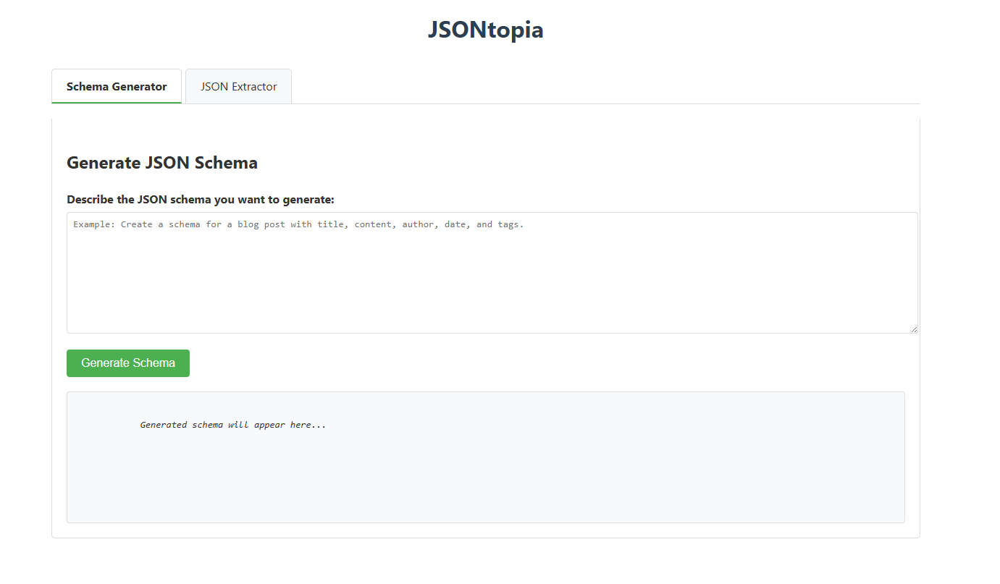
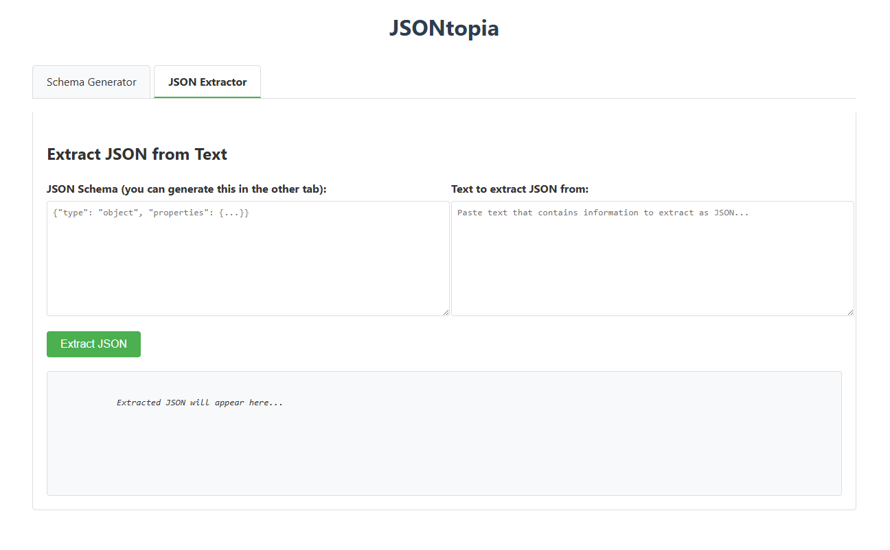

# JSONtopia

A JSON tooling service to generate JSON schemas from descriptions and extract structured JSON data from text.

## Features

- **JSON Schema Generator**: Generate JSON schemas from natural language descriptions
- **JSON Extractor**: Extract structured data from text based on a JSON schema
- **Streaming API**: Real-time streaming responses for both generation and extraction
- **Web UI**: Interactive user interface for testing the API endpoints

## Demo


*JSON Schema Generator: Automatically create JSON schemas from natural language descriptions*


*JSON Extractor: Extract structured data from text based on your schema*

## Getting Started

### Prerequisites

- Python 3.13
- OpenAI API key

### Installation

1. Clone this repository
2. Install dependencies:
   ```bash
   pip install -r requirements.txt
   ```
3. Set up environment variables:
   ```bash
   # Create a .env file with your OpenAI API key
   OPENAI_API_KEY=your_openai_api_key
   OPENAI_MODEL=gpt-4.1-mini  # or your preferred model
   OPENAI_TEMPERATURE=0
   ```

### Running the Application

```bash
python main.py
```

The application will start at `http://localhost:8080`

## Using the Web UI

1. Open `http://localhost:8080` in your browser
2. The UI has two tabs:
   - **Schema Generator**: Enter a description to generate a JSON schema
   - **JSON Extractor**: Paste a JSON schema and text to extract structured data

### Schema Generator

1. Enter a description of what you want the JSON schema to represent
2. Click "Generate Schema"
3. The schema will be generated in real-time with streaming updates
4. The generated schema can be used in the JSON Extractor tab

### JSON Extractor

1. Enter a JSON schema (can be generated from the Schema Generator tab)
2. Enter text containing information that matches the schema
3. Click "Extract JSON"
4. The structured JSON data will be extracted in real-time with streaming updates

## API Endpoints

### Generate JSON Schema
- `POST /suggest`: Generate a JSON schema from a description
- `POST /suggest/stream`: Stream the JSON schema generation results

### Extract JSON
- `POST /extract`: Extract structured JSON from text based on a schema
- `POST /extract/stream`: Stream the JSON extraction results

## License

MIT
